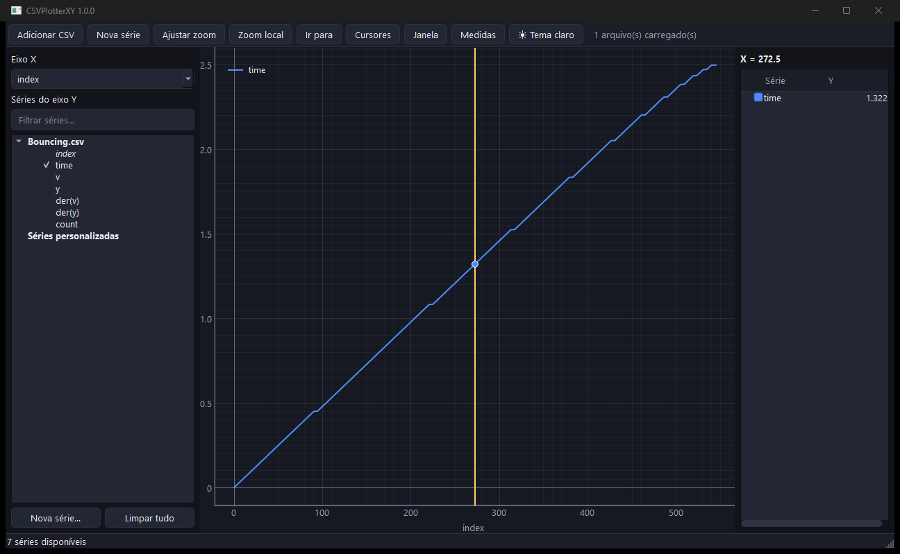

# CSVPlotterXY

Aplicativo **desktop** para plotagem e análise interativa de arquivos **CSV**,
inspirado no MC PlotXY. Feito em Python com PySide6 + PyQtGraph — leve, rápido
e fluido, com navegação estilo Desmos.



## Recursos

- **Projeto multi-arquivo**: carregue vários CSVs (diálogo, arrastar e soltar
  ou menu Recentes); plote séries de arquivos diferentes no mesmo gráfico.
  Cada coluna vira uma série; cada arquivo expõe também a série `index`
  (número da linha).
- **CSV brasileiro/europeu**: detecção automática de separador (`,` `;` ou
  tab) e de vírgula decimal — arquivos exportados de Excel/equipamentos no
  padrão BR abrem sem conversão.
- **Projeto salvo (`.plotxy`)**: salve e reabra a sessão inteira — arquivos,
  seleção X/Y, expressões, cores, vista e tema (menu Arquivo).
- **Seleção de eixos**: qualquer série como X, quaisquer séries como Y;
  clique na legenda oculta/exibe a série em toda a interface.
- **Séries personalizadas por expressão**: `+ - * / **`, parênteses,
  `abs()`, `sqrt()`, `sin()`, `cos()`, `tan()`, `exp()`, `log()`, `log10()`
  e os operadores **`D()`** (derivada) e **`I()`** (integral acumulada) em
  relação ao eixo X. Avaliador seguro por AST (sem `eval`).
- **Espectro (FFT)**: janela com o espectro de amplitude unilateral das
  séries visíveis (aviso quando a amostragem não é uniforme).
- **Exportar imagem**: PNG/SVG ou cópia direta para a área de transferência
  (menu Arquivo).
- **Cursores**: vertical e horizontal, arrastáveis, exibindo **todas** as
  interseções com cada série; painel lateral por cursor; opção de restringir o
  movimento aos pontos originais.
- **Janela Medidas**: selecione um intervalo (campos A/B ou mouse, sincronizados)
  e veja Máx, Mín, Média, ΔX, ΔY e Área por série.
- **Navegação**: zoom/pan ilimitados sem distorção; zoom independente por eixo
  (scroll sobre o eixo); painel de zoom local; escala manual dos eixos; "Ir para".
- **Visual**: temas claro/escuro, eixos de origem destacados, tooltip de ponto
  ao clicar na curva (interpolado), cor de série editável.
- **Desempenho**: decimação min/max ciente da vista — navegação fluida com
  séries de até ~1.000.000 de pontos, preservando o envelope exato.

## Como funciona o pareamento X/Y

Cada ponto plotado é `(x[i], y[i])` — o X e o Y são combinados **pela posição
da linha**, não pelo valor. Ou seja: 1ª linha de X com 1ª linha de Y, 2ª com
2ª, e assim por diante. Isso vale mesmo quando X e Y vêm de **arquivos
diferentes**: não há busca por timestamp equivalente nem interpolação entre
arquivos, só o índice da linha.

Se as séries escolhidas tiverem tamanhos diferentes, o excedente da mais longa
é descartado (a interface avisa quando isso acontece) — o gráfico usa sempre
`n = mínimo dos tamanhos` pontos.

**Na prática:** para combinar séries de arquivos distintos, garanta que as
linhas já estejam alinhadas (mesma taxa de amostragem, mesmo início) antes de
carregar os CSVs.

## Download (Windows)

Baixe o `CSVPlotterXY.exe` mais recente na página de
**[Releases](https://github.com/Lucas4964/CSVPlotterXY/releases)**. É um único
executável, não precisa instalar Python nem dependências.

> Como o executável não é assinado digitalmente, o Windows SmartScreen pode
> exibir um aviso na primeira execução. Clique em **Mais informações → Executar
> assim mesmo**.

## Rodar a partir do código-fonte

```powershell
git clone https://github.com/Lucas4964/CSVPlotterXY.git
cd CSVPlotterXY
py -3 -m venv .venv
.venv\Scripts\python -m pip install -r requirements.txt
.venv\Scripts\python -m plotxy_app "caminho\para\seu_arquivo.csv"
```

(Requer Python 3.11+.)

## Compilar o executável

```powershell
.venv\Scripts\python -m pip install -r requirements-dev.txt
.venv\Scripts\python -m PyInstaller packaging\CSVPlotterXY.spec
```

O `CSVPlotterXY.exe` é gerado em `dist\`. O ícone (`packaging/icon.ico`) já vem
pronto; para regenerá-lo, rode `python packaging\make_icon.py`.

Cada tag `v*` enviada ao GitHub dispara o workflow em
[`.github/workflows/build.yml`](.github/workflows/build.yml), que roda os testes,
compila o `.exe` e o anexa à Release automaticamente.

## Testes

```powershell
.venv\Scripts\python -m pytest -q
```

## Licença

[MIT](LICENSE) © 2026 Lucas Maximus.
